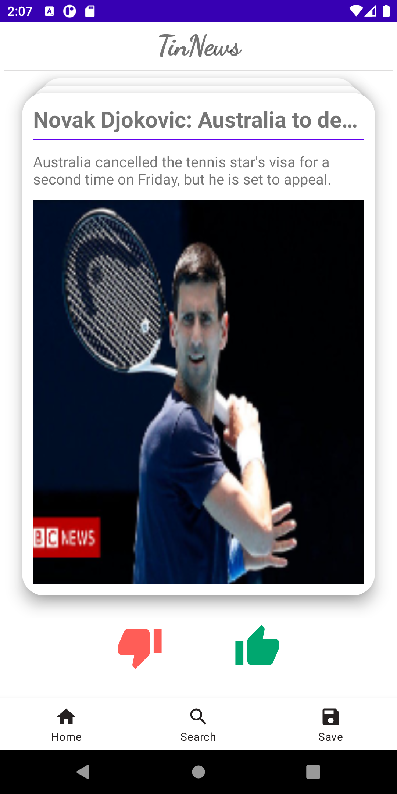
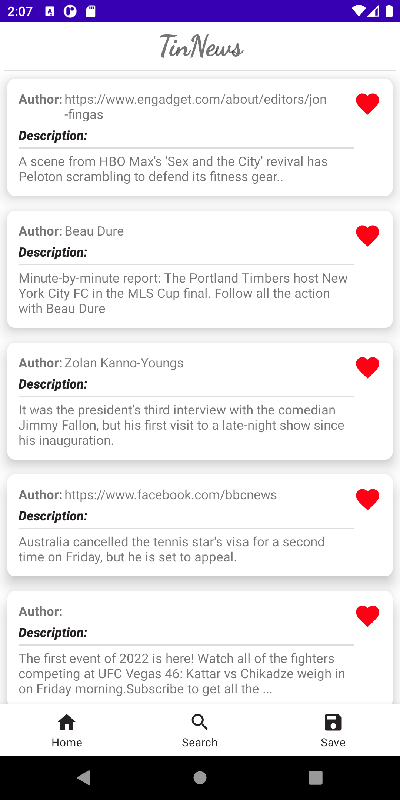
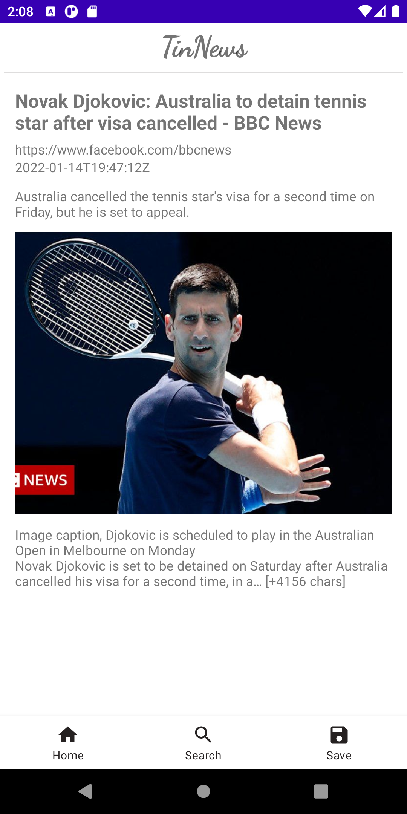
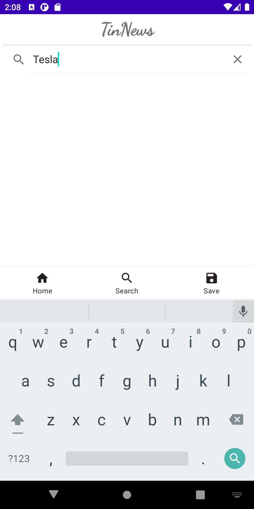
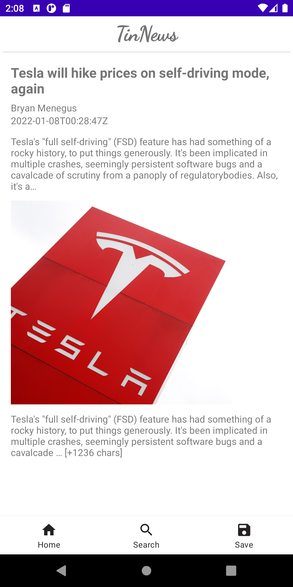

# TinNews Android App
This project was implemented on [Android Studio](https://developer.android.com/studio) platform. Architecture patterns was implemetned by [Google component MVVM](https://developer.android.com/jetpack/guide). Retrofit and LiveData were utilized to scrape latest news data from a RESTFUL endpoint. Bottom bar & page navigation were built via JetPack navigation component. Room Database with ViewModel & LiveData were used to support local cache and offline model. 

The introduction of above terminologies could found in [LiveData, Retrofit, Android Architecture Component](https://medium.com/@amtechnovation/android-architecture-component-mvvm-part-1-a2e7cff07a76).

## How to run the project to launch web app
1. You will need to have Android Virtual Device (AVD) to run the app.
3. Built an emulator via AVD manager, Pixel 3 or 4 are recommended.
4. Click run button to run app, an emulator should pop up and link to the TinNews App.
4. If the app didn't pop up, please check if app is created at desktop. If yes, please double click on the app icon.

## What can we do on this App
1. At Home page, you will see a Tinder-like interface, showing the most recent or popular news, with images and description. This card stack view allows you to hit like/dislike or swipe right/left to store or skip the news

2. You could see three bottom navigation bar, default is set at *Home*. If you hit *Save*, you will be navigated to the interface where stored all news that you liked before. In our case, the previous tennis news could be found in the list (4th fom top).

3. If you wish to read the details of the news, you could click on the article cell. If you wish to remove any news from this save list, just click on the *heart* icon.

4. We also offer you the capability of searching keyword for specific news. Please click *Search* to launch this functionality. At the searching field, just type the keyword you want to search.

5. After hitting *enter*, you should be able to see bunches of news related to the keyword, scroll down to explore more. These news are live and kept retrieving from LiveData.

6. Same as Save, if you wish to explore more details on any news, just simply click on the image of it.

10. Enjoy linking more with your beloved news!  :)